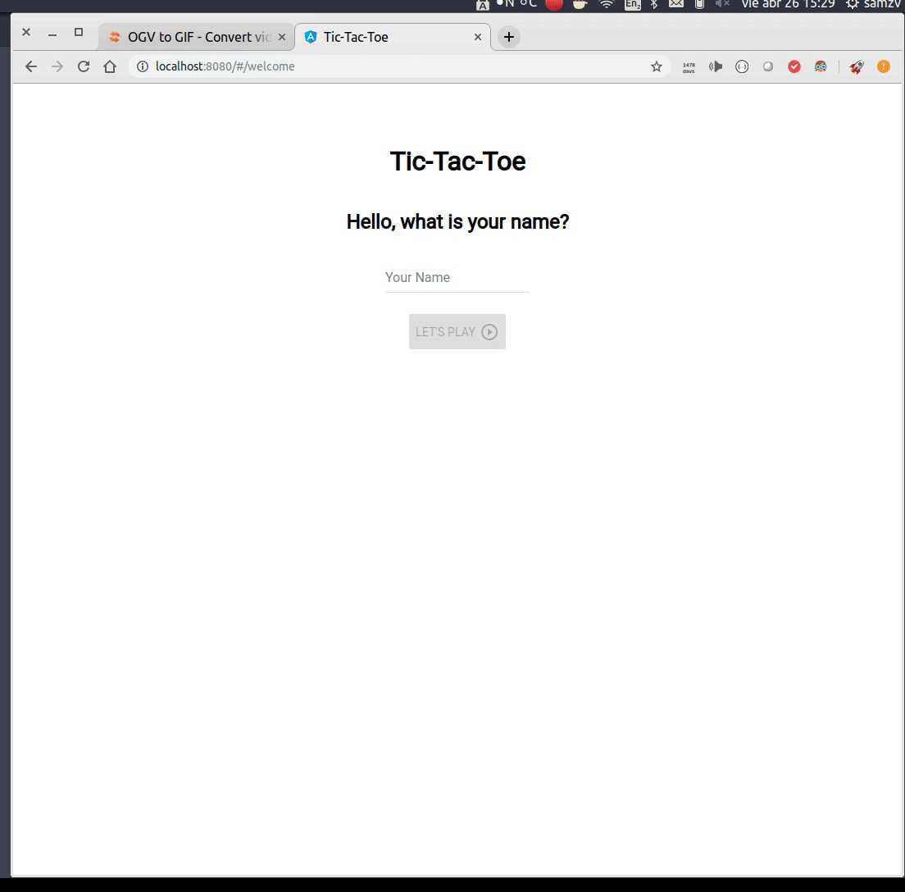
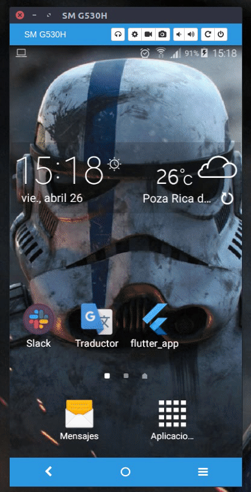

# Welcome to Tic Tac Toe

# Goal
The goal of this repo is to implement a web app with Angular Dart and the mobile version using Flutter, trying to share among them as much code as possible using the bloc pattern.

The bloc behaviour was implemented using the [bloc] library (https://pub.dartlang.org/packages/bloc).

The state and functions to handle the game were isolated into the **common** folder which contains the shared bloc logic.

# Screenshots
| Angular Dart App | Flutter App |
|--|--|
|  |  |

# Cloning the repo
git clone https://github.com/samuelzv/tic-tac-toe 

# Running Angular Dart App
cd tic-tac-toe/angular_app

pub get

webdev serve

# Running the Flutter App
Setup your device

cd tic-tac-toe/flutter_app

flutter run

